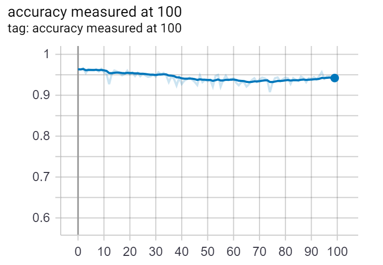
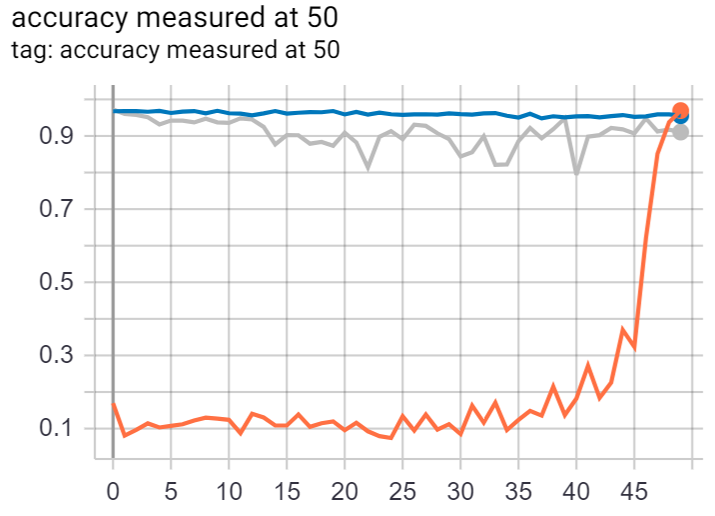

# Continual Learning with Hypernetworks
The main purposes of this project was to learn what is the state of continual learning with neural networks and to reproduce one of the most interesting works from this domain.

*TODOS:*
* PermutedMNIST-100
    * ✔ Create meta model, that generates models, as in [1]
    * ✔ Make hypernetworks learn **chunks** of smaller network, not all weights at once
    * ✔ Inject hypernetwork from playground to separate model, i.e. "Lenet Hypernet"
    * ✔ Reproduce hypernetwork result on separate task (over 90% accuracy)
    * ✔ Make it learn anything in continual learning scenario and generate tokens for tasks
    * ✔ Create evaluations that cheats and **knows** what task to do now!
    * ✔ Test HyperNetwork in continual learning scenario
    * ✔ Use regularization to finally stop the forgetting
    * ✔ Create `train.py` to run full pipeline easily
    * ✔ Make sure network matches results from [1]
        * ✔ It doesn't. I see a difference in regularization implementation and it need to be fixed! Look at [1]
    * ✔ Prepare clean tensorboard logs and keep them visible in `logs` folder
    * ✔ Add plot pictures to report

  
# Continual Learning
It is learning scenario in which there are multiple distinct tasks for model to learn. The most accurate way to do this is probably to learn all the tasks at once. E.g. having ten different tasks of classification with ten classes each, one can sample one example from each task and construct a batch from them which could be used to train a network. This method would bring the best possible accuracy for such multitask learning neural network. However, such learning is not considered continual learning. This is because sometimes, not all tasks are available at once or sometimes, not all tasks can fit in the memory at once. These would be the cases of practical uses for continual learning. Although, even in those cases, it could be better to train separate models for separate tasks. However, we expect general artificial intelligence to be able to solve multiple tasks, because humans and animals are able to do so. This itself might be a good reason to develop better continual learning algorithms. In continual learning we want a model that doesn't forget old skills, when learning something new.

## Catastrophic forgetting
A natural thing to try when learning multiple tasks is to learn first task, do fine-tuning for rest of the tasks, one after another, and hope that network will not forget previous tasks. Unfortunately, this is not what happens. Networks tend to forget everything they learnt after just a few iterations of learning new tasks. This is called catastrophic forgetting. Effective and simple strategy to fight it is to do rehearsal, so to perform learning steps on the samples replayed from history when learning a new task. However, it requires storing samples and becomes complicated when the number of tasks grows. Another topic is, when testing continual learning model, one can use so called task-oracle, which tells the mode what task it should predict now. There are papers that focus on avoiding using it, often by measuring entropy of model's prediction. This is not our focus though.

# Hypernetworks
It is a meta neural network, i.e. a network that learns to generate neural networks. It does so, by taking **task token** as input and generating a set of weights, which can be then used as kernels and biases in any neural network. In simplest case, it would be a densely connected neural network that is generated, but it could be a convolutional or recurrent neural network as well. Since for modern networks there are too many weights to generate at once, we do it in chunks, as in [1]. The network must know which chunk it is generating, so all chunks have their own chunk token which is not task specific -- it is shared between all the tasks. It is important for both task token and chunk token to be learnable. The whole structure is differentiable, so we can take the derivatives with respect to those tokens. An important difference between those tokens is that, task token remains frozen after their task is learnt by the network, while chunk tokens are learnable all the time.

## Task regularization
Task embeddings are not enough to stop catastrophic forgetting during the training. Even though such task embedding remain frozen, the networks continues to evolve and the same task embedding will not return the same weights for inner network after few updates. This is why we have to use **task regularization**. In short, each time when we update the network, we add a task regularization term to the loss function. This regularization is responsible for keeping generated inner networks similar to as they were before beginning learning of the new task. The consequence is, during learning new task we need not only to keep all the task tokens, but also a snapshot of hypernetwork weights before we began training on new task. When we finish training on task 1, we need to store the task 1 token. Then when training hypernetwork on the second task, we will save hypernetwork snapshot and use regularization -- summed squared difference of previously saved snapshot and current set of weights that hypernetwork generates when task 1 token is the input. Finally, we use such regularization for each new task we want hypernetwork to remember.

In practice, we perform two updates for each batch, as it is two-step optimization in [1]. First, we perform one update, optimizing for current task, in our case using Adam optimizer. This update does not contain task regularization at all. Second, we perform regularization update, which is calculated from loss consisting of avereged L2 distance between current inner network weights for old tasks embeddings and their snapshots from before new task training began. This is described in details in [1].

In our implementation, each remembered task requires one additional training step when learning new tasks. This is bad, as it grows in time linearly with the number of tasks. The solution is to sample, in each training step, a subset of tasks we will regularize from. In our case, when there's over 50 tasks, the model will start sampling 30 of them in each training step and regularize from them. This way, the time will not further increase and will stay constant. This is done in [1] as well and exists for efficiency purpose only.

## Advantages of hypernetworks:
### Network compression
If the number of chunks is big, time to compute all the networks parameters might grow, since we need to run the network generator for as many times as there are chunks. From the other side, such networks has less output neurons, thus less parameters. In standard scenario, in our case with 40 chunks, such networks is often smaller than the network it generates. This is why hypernetworks are considered networks' compressors.

### Direct representation of tasks
For each task, we learn a task token (task embedding), which is just a vector, so it reminds word vectors like in word2vec. With such embeddings, one can check if two tasks are similar by checking the distance in the space of embeddings. Most of the time, we use task embeddings of size 50 or 100 which we then concatenate with chunk embedding of the same size. Since tasks embedding are much smaller than full sets of weights of a neural network, it is easy and almost free to save them for, e.g. 100 tasks. This wouldn't be the case, if we wanted to save 100 separate neural networks, each for different task. Although, in both cases the theoretical memory complexity is linear in terms of the number of tasks. In practice, in this approach, storing task embeddings is as good as free.
    
# PermutedMNIST-100 benchmark
This is a standard benchmark used in continual learning papers. It artificially creates a set of tasks using vanilla MNIST dataset. MNIST is a dataset of handwritten digits, there are 70000 of them and they are split into 10 classes. The images are of size 28 by 28 and since we use dense neural networks in this report, we reshape them to 784 dimensions each. Each new task in PermutedMNIST is created by randomly permuting all the pixels from original task in each image. Note that for densely connected neural network it does not matter, given every image in the dataset is permuted in the same way. However, brand new permutation is a brand new task for the network, which is not suitable for transfer learning, since those task do not have much in common. Except for global features like global pixel statistics it cannot transfer anything from one task to another. This benchmark is a basic continual learning scenario.


# Project structure

* *experiments.yaml*, available parameters:
    * **logdir**: string, name of the folder containing run logs
    * **run_name**: string, name of the folder containing run logs
    * **n_tasks_to_learn**: int($\leq 100$), number of tasks to learn from PermutedMNIST dataset
    * **full_testing_tasks**: list of ints, contains tasks indices where you want long validation to be performed. After tasks listed in this list, it will be tested if model remembers all of the previous tasks. Also, result will be saved as "accauracy measured at N" in tensorboard, for each N in this list
    * **batch_size**: int, network will generate gradient update from this many examples in each step
    * **task_embedding_dim**: int, each task will be represented as vector of this many dimensions. Also chunk dimensionality will be equal to this number
    * **num_chunks**: int, since deep neural networks contain too many parameters to learn at once, they will be split into this many parts
    * **hypernet_hidden_dims**: list of ints, dimensionality of dense network that generates inner neural network. This list should contain only *hidden* layer dimensionality, e.g. can be empty if the network should not contain hidden layers
    * **innernet_all_dims**: list of ints, dimensionality of dense network generated by hypernetwork. This list should contain *all* layer dimensionality, i.e. cannot be empty and must contain input and output sizes.
    * **l2_regularization**: float, parameter for vanilla l2 regularization for neural network
    * **l2_memory_regularization**: float, special regularization for continual learning with hypernetwork. To avoid catastrophic forgetting, we regularize the network and this is the regularization parameter
    * **iters_per_task**: int, hypernetwork performs this many gradient updates before beginning learning new task. This does not need to be large for continual learning, but will bigger number networks will be better as well

    * example of `experiments.yaml` containing two experiments:
```
    logdir: logs
    run_name: test_run
    n_tasks_to_learn: 100
    full_testing_tasks: [10, 20, 50]
    batch_size: 128
    task_embedding_dim: 100
    num_chuks: 40
    hypernet_hidden_dims: [200, 300]
    innernet_all_dims: [784, 300, 10]
    l2_regularization: 1e-4
    l2_memory_regularization: 1e-2
    iters_per_task: 3000
    ‌‌ ---‌‌
    logdir: logs
    run_name: test_run
    n_tasks_to_learn: 100
    full_testing_tasks: []
    batch_size: 128
    task_embedding_dim: 50
    num_chuks: 60
    hypernet_hidden_dims: [200, 300]
    innernet_all_dims: [784, 100, 10]
    l2_regularization: 1e-6
    l2_memory_regularization: 1e-1
    iters_per_task: 1000

    # don't copy this, as the parameter names might have changed slightly
    # use original experiments.yaml file which was tested and works
```

* *run_experiments.py*: use this file to run all the experiments specified in `experiments.yaml`. Use: `python run_experiments.py`
* *logs*: use this directory with tensorboard, e.g. `tensorboard --logdir logs`, then enter `http://localhost:6006` address in browser

# Results


> Results of our model on PermutedMNIST-100 task. On X-axis there are 100 different task it was trained on, on Y-axis there's the accuracy on tasks measured at the very end of the training.

We have been able to reproduce results from [1] and there are logs of those experiments available in `logs` folder. You can see models that have been successfully trained on all of 100 tasks and we avoided catastrophic forgetting. We performed multiple hyperparameter and models testings and included some of results in logs folder. In original `experiments.yaml` we left some of successful experiments which can be run, provided one has packages listed in `requirements.txt`. We systematically updated our repository our latest code and results. Data will be downloaded automatically by `tensorflow_datasets` packages.


> Comparison of models on PermutedMNIST-50 task. Three models are being compared: big hypernetwork in blue, small hypernetwork in grey and a model that has no memory mechanism at all in orange. As one can see, hypernetworks with regularization work well in continual learning and prevent forgetting.

More logs are available in folder logs, which can be opened with tensorboard!

## Description of logs in tensorboard:
IMPORTANT: For each experiment, contents of its `.yaml` file is stored in *Text* section in tensorboard!

There are multiple metrics stored for each model and in this section you can find their description.
* **accuracy measured at N**: after learning N-th task, evaluation on all previous tasks is performed. In other words *accuracy measured at 10* is PermutedMNIST-10 and *accuracy measured at 100* is PermutedMNIST-100
* **task 0 accuracy**: as we don't want to evaluate all tasks too often, to check if the catastrophic forgetting happened, after learning each task we just check what is its accuracy at task number 0

**References:**
1. Continual learning with hypernetworks, <https://arxiv.org/abs/1906.00695>
2. Three scenarios for continual learning, <https://arxiv.org/abs/1904.07734>
3. HyperNetworks, <https://arxiv.org/abs/1609.09106>
